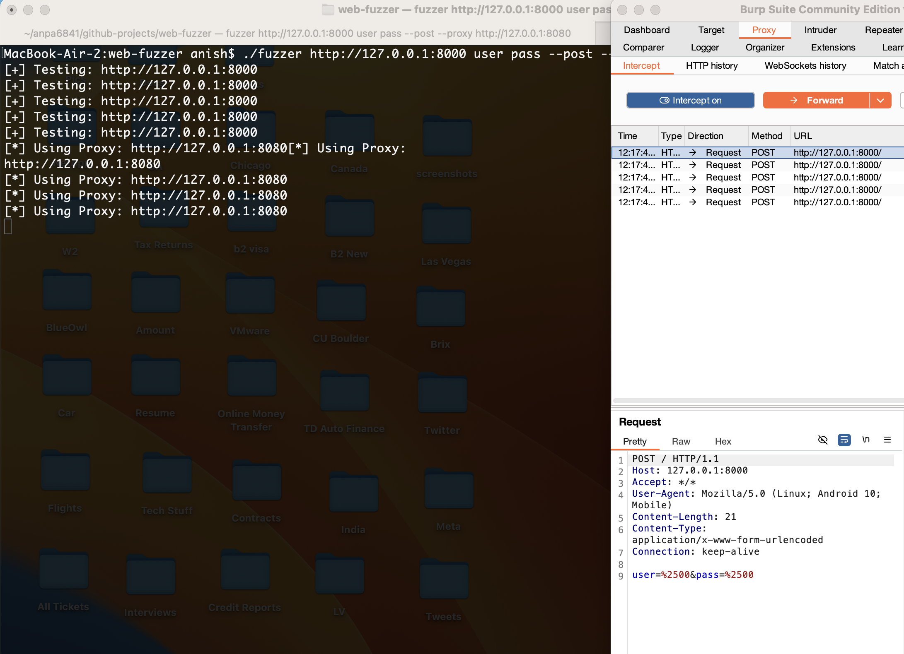

### Running the Program

- make
- ./fuzzer http://example.com test
- python -m http.server

<pre>
MacBook-Air-2:web-application-fuzzer anish$ python -m http.server
Serving HTTP on :: port 8000 (http://[::]:8000/) ...
::ffff:127.0.0.1 - - [14/Feb/2025 20:31:56] "GET /?test=%27%20OR%20%271%27%3D%271 HTTP/1.1" 200 -
::ffff:127.0.0.1 - - [14/Feb/2025 20:31:56] "GET /?test=..%2F..%2Fetc%2Fpasswd HTTP/1.1" 200 -
::ffff:127.0.0.1 - - [14/Feb/2025 20:31:56] "GET /?test=admin%27%20-- HTTP/1.1" 200 -
::ffff:127.0.0.1 - - [14/Feb/2025 20:31:56] "GET /?test=%3Cscript%3Ealert%28%27XSS%27%29%3C%2Fscript%3E HTTP/1.1" 200 -
::ffff:127.0.0.1 - - [14/Feb/2025 20:31:56] "GET /?test=%2500 HTTP/1.1" 200 -
</pre>

<pre>
MacBook-Air-2:web-application-fuzzer anish$ ./fuzzer http://127.0.0.1:8000 test
[+] Testing: http://127.0.0.1:8000?test=%27%20OR%20%271%27%3D%271
[+] Testing: http://127.0.0.1:8000?test=..%2F..%2Fetc%2Fpasswd
[+] Testing: [+] Testing: http://127.0.0.1:8000?test=%3Cscript%3Ealert%28%27XSS%27%29%3C%2Fscript%3E
[+] Testing: http://127.0.0.1:8000?test=%2500
http://127.0.0.1:8000?test=admin%27%20--
...
...
...
</pre>

🔨 Usage Examples

1. Fuzz GET Request

./fuzzer http://127.0.0.1:8000 username email

Injects payloads into username, and email parameters.

<pre>
MacBook-Air-2:web-application-fuzzer anish$ python -m http.server
Serving HTTP on :: port 8000 (http://[::]:8000/) ...
::ffff:127.0.0.1 - - [15/Feb/2025 11:57:46] "GET /?username=%3Cscript%3Ealert%28%27XSS%27%29%3C%2Fscript%3E&email=%3Cscript%3Ealert%28%27XSS%27%29%3C%2Fscript%3E HTTP/1.1" 200 -
::ffff:127.0.0.1 - - [15/Feb/2025 11:57:46] "GET /?username=admin%27%20--&email=admin%27%20-- HTTP/1.1" 200 -
::ffff:127.0.0.1 - - [15/Feb/2025 11:57:46] "GET /?username=%2500&email=%2500 HTTP/1.1" 200 -
::ffff:127.0.0.1 - - [15/Feb/2025 11:57:46] "GET /?username=..%2F..%2Fetc%2Fpasswd&email=..%2F..%2Fetc%2Fpasswd HTTP/1.1" 200 -
::ffff:127.0.0.1 - - [15/Feb/2025 11:57:46] "GET /?username=%27%20OR%20%271%27%3D%271&email=%27%20OR%20%271%27%3D%271 HTTP/1.1" 200 -
</pre>

2. Fuzz POST Request

./fuzzer http://127.0.0.1:8000 login user pass --post

Sends payloads in POST body as user=[payload]&pass=[payload].

<pre>
MacBook-Air-2:web-application-fuzzer anish$ python -m http.server
Serving HTTP on :: port 8000 (http://[::]:8000/) ...
::ffff:127.0.0.1 - - [15/Feb/2025 11:58:10] code 501, message Unsupported method ('POST')
::ffff:127.0.0.1 - - [15/Feb/2025 11:58:10] "POST / HTTP/1.1" 501 -
::ffff:127.0.0.1 - - [15/Feb/2025 11:58:10] code 501, message Unsupported method ('POST')
::ffff:127.0.0.1 - - [15/Feb/2025 11:58:10] "POST / HTTP/1.1" 501 -
::ffff:127.0.0.1 - - [15/Feb/2025 11:58:10] code 501, message Unsupported method ('POST')
::ffff:127.0.0.1 - - [15/Feb/2025 11:58:10] code 501, message Unsupported method ('POST')
::ffff:127.0.0.1 - - [15/Feb/2025 11:58:10] code 501, message Unsupported method ('POST')
::ffff:127.0.0.1 - - [15/Feb/2025 11:58:10] "POST / HTTP/1.1" 501 -
::ffff:127.0.0.1 - - [15/Feb/2025 11:58:10] "POST / HTTP/1.1" 501 -
::ffff:127.0.0.1 - - [15/Feb/2025 11:58:10] "POST / HTTP/1.1" 501 -
</pre>

3. Proxy Support

- ./fuzzer http://127.0.0.1:8000 user pass --post --proxy http://127.0.0.1:8080

<pre>
MacBook-Air-2:web-application-fuzzer anish$ python -m http.server
Serving HTTP on :: port 8000 (http://[::]:8000/) ...
::ffff:127.0.0.1 - - [15/Feb/2025 12:18:21] code 501, message Unsupported method ('POST')
::ffff:127.0.0.1 - - [15/Feb/2025 12:18:21] "POST / HTTP/1.1" 501 -
::ffff:127.0.0.1 - - [15/Feb/2025 12:18:21] code 501, message Unsupported method ('POST')
::ffff:127.0.0.1 - - [15/Feb/2025 12:18:21] "POST / HTTP/1.1" 501 -
::ffff:127.0.0.1 - - [15/Feb/2025 12:18:22] code 501, message Unsupported method ('POST')
::ffff:127.0.0.1 - - [15/Feb/2025 12:18:22] "POST / HTTP/1.1" 501 -
::ffff:127.0.0.1 - - [15/Feb/2025 12:18:22] code 501, message Unsupported method ('POST')
::ffff:127.0.0.1 - - [15/Feb/2025 12:18:22] "POST / HTTP/1.1" 501 -
::ffff:127.0.0.1 - - [15/Feb/2025 12:18:22] code 501, message Unsupported method ('POST')
::ffff:127.0.0.1 - - [15/Feb/2025 12:18:22] "POST / HTTP/1.1" 501 -
</pre>

- ProxyDemoLink: [https://github.com/anpa6841/web-application-fuzzer/blob/master/FuzzerProxyDemo.mov]

